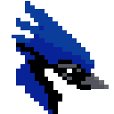

<p align="center">
  
</p>

<h1 align="center">BirdEngine 🐦</h1>

<p align="center">
  
  
  
  
</p>

<p align="center">
  
  
</p>

---
**BirdEngine** é um motor de jogo 2D leve, rápido e intuitivo com scripting em **Lua**. O núcleo é escrito em **C puro** com **SDL2**, exposto para Lua via **LuaJIT FFI** — você escreve toda a lógica do seu jogo em Lua sem abrir mão da performance nativa.

> Feito para quem quer fazer jogos retro, pixel-art e low-res sem cerimônia.

---

## Índice

- [Arquitetura](#arquitetura)
- [Framebuffer Virtual](#framebuffer-virtual)
- [Lich — Biblioteca Matemática](#lich--biblioteca-matemática)
- [Portabilidade](#portabilidade)
- [Estrutura de Pastas](#estrutura-de-pastas)
- [Começando](#começando)
- [API de Referência](#api-de-referência)
  - [Janela e Loop Principal](#janela-e-loop-principal)
  - [Entrada (Teclado e Mouse)](#entrada-teclado-e-mouse)
  - [Sprites e Atlas](#sprites-e-atlas)
  - [Animações](#animações)
  - [Primitivas 2D](#primitivas-2d)
  - [Fontes Bitmap](#fontes-bitmap)
  - [Câmera 2D](#câmera-2d)
  - [Mapas 2D e Tiles](#mapas-2d-e-tiles)
  - [Colisão AABB](#colisão-aabb)
  - [Filtros de Pós-processamento](#filtros-de-pós-processamento)
  - [Áudio](#áudio)
- [Paletas de Cores](#paletas-de-cores)

---

## Arquitetura

```
┌─────────────────────────────────────┐
│         Seu jogo em Lua             │  ← bird.lua  (API amigável)
├─────────────────────────────────────┤
│        LuaJIT FFI Bridge            │  ← engineffi.lua
├─────────────────────────────────────┤
│     Núcleo C  (libbird.so)          │
│  ┌──────────┐  ┌────────────────┐   │
│  │ Render   │  │ Audio (SDL_mix)│   │
│  │ Input    │  │ Mapas / Objetos│   │
│  │ Lich.h   │  │ FFI / bird.c   │   │
│  └──────────┘  └────────────────┘   │
├─────────────────────────────────────┤
│            SDL 2                    │  ← janela, eventos, textura de saída
└─────────────────────────────────────┘
```

O motor é dividido em módulos independentes em C:

| Módulo | Responsabilidade |
|---|---|
| `Render/renderizador.c` | Framebuffer, sprites, primitivas, câmera, fontes |
| `Render/filtro.c` | Filtros de pós-processamento sobre o framebuffer |
| `Inputs/input.c` | Teclado, mouse, input de texto |
| `Mapas/mapa.c` | Mapa 2D baseado em caracteres, flags de tile |
| `Objetos/objetos.c` | Objetos 2D com posição, escala, rotação e AABB |
| `Audio/audio.c` | Música e efeitos sonoros via SDL_mixer |
| `FFI/bird.c` | Camada pública exposta ao LuaJIT |
| `Lich.h` | Matemática pura (header-only, sem libm) |

---

## Framebuffer Virtual

O BirdEngine **não desenha direto na janela**. Em vez disso, mantém um buffer de pixels interno em baixa resolução (ex: 128×128, 160×144, 320×240 — você escolhe). Toda renderização acontece nesse buffer em memória. No final de cada frame, o buffer é copiado para uma textura SDL2 e escalado para o tamanho real da janela.

**Por que isso importa?**

- **Pixel-perfect garantido** — cada pixel do jogo é exatamente um pixel lógico, sem sub-pixels ou borramento.
- **Filtros gratuitos** — como o buffer é um array de `uint32_t`, é trivial percorrê-lo e aplicar efeitos (paleta de cores, ruído, scanlines, pixelização) sem custo extra de GPU.
- **Performance previsível** — renderizar 128×128 pixels em C é instantâneo. O custo de CPU é determinístico.
- **Escala livre** — `ampliar: 5` cria uma janela 640×640 a partir de 128×128 sem nenhum custo adicional.

```
framebuffer [128×128 uint32_t]
        ↓  escalado pelo SDL2
  janela real [640×640]
```

---

## Lich — Biblioteca Matemática

`Lich.h` é uma biblioteca matemática **header-only**, escrita inteiramente em C inline, **sem dependência de `<math.h>` ou `libm`**. Ela usa tabelas de lookup (LUT) e aproximações por série de Taylor para todas as funções trigonométricas e exponenciais.

### Por que Lich?

| Característica | Lich | libm padrão |
|---|---|---|
| Dependência externa | Nenhuma | `libm` |
| Linkagem | Header-only | `‑lm` |
| `sin`/`cos` | LUT com interpolação | Implementação da libc |
| `sqrt` | Fast inverse sqrt (Quake) | Instrução FPU |
| Ponto fixo (Q16.16) | Sim | Não |
| Operações de cor RGBA | Sim | Não |
| Vetores 2D/3D inline | Sim | Não |
| Iluminação difusa/especular | Sim | Não |

### Grupos de funções

**Escalares float**
```c
lich_sinf(ang)    lich_cosf(ang)   lich_tanf(ang)
lich_sqrtf(v)     lich_powf(a, b)  lich_lerpf(a, b, t)
lich_clampf(v, mn, mx)             lich_fmodf(x, y)
```

**Ponto fixo Q16.16** — útil para física determinística
```c
int32_t fp = lich_fp_de_float(3.14f);
fp = lich_fp_mul(fp, outro_fp);
float resultado = lich_fp_para_float(fp);
```

**Cor RGBA empacotada**
```c
lich_rgba(r, g, b, a)          // empacotar
lich_rgba_blend(dst, src)       // alpha blending
lich_rgba_lerp(ca, cb, t)       // interpolação de cor
lich_rgba_iluminar(cor, i)      // aplicar intensidade de luz
lich_rgba_neblina(cor, fog, t)  // mistura de fog
```

**Vetores 2D/3D**
```c
lich_v2_dot / lich_v2_len / lich_v2_norm / lich_v2_rot / lich_v2_reflect
lich_v3_dot / lich_v3_len / lich_v3_cross / lich_v3_norm
```

**Iluminação**
```c
lich_luz_difusa(nx, ny, nz, lx, ly, lz)
lich_luz_especular_blinn(nx, ny, nz, hx, hy, hz, exp)
lich_fog_linear(z, inicio, fim)
lich_fog_exp2(z, densidade)
```

Lich também é exposta para Lua via FFI, então você pode chamar `C.lich_lerpf(a, b, t)` diretamente nos seus scripts.

---

## Portabilidade

O BirdEngine foi desenhado para rodar em qualquer lugar onde SDL2 esteja disponível:

- **Linux** — compilado como `libbird.so`, distribuível via AppImage
- **Windows** — `windons/build.bat` produz a DLL nativa
- **macOS** — SDL2 disponível via Homebrew; mesmo makefile funciona
- **Raspberry Pi / SBCs** — SDL2 tem backend KMSDRM, roda sem Xorg
- **Web (futuro)** — Emscripten + SDL2 port é o caminho natural

A camada FFI em `engineffi.lua` tenta carregar a biblioteca em múltiplos caminhos automaticamente:

```lua
local candidates = {
    "bird",           -- PATH do sistema
    "./libbird.so",   -- diretório atual
    dir .. "libbird.so",
    dir .. "../libbird.so",
}
```

Nenhuma mudança de código é necessária para mudar de plataforma.

---

## Estrutura de Pastas

```
projeto/
├── assets/          # Sprites, músicas, fontes
├── lua/
│   ├── bird.lua     # API Lua amigável
│   └── engineffi.lua# Declarações FFI do núcleo C
├── src/
│   ├── Audio/       # audio.c / audio.h
│   ├── FFI/         # bird.c  — ponto de entrada da biblioteca
│   ├── Inputs/      # input.c / input.h
│   ├── Mapas/       # mapa.c  / mapa.h
│   ├── Objetos/     # objetos.c / objetos.h
│   ├── Render/      # renderizador.c/h, filtro.c/h
│   ├── Lich.h       # Matemática header-only
│   └── tipos.h      # Tipos compartilhados (Janelas, Atlas, etc.)
├── include/
│   └── stb_image.h  # Carregamento de PNG/JPG
├── libbird.so       # Biblioteca compilada (Linux)
├── main.lua         # Ponto de entrada do seu jogo
├── makefile
└── rodar.sh
```

---

## Começando

### Pré-requisitos

```bash
# Ubuntu / Debian
sudo apt install luajit libsdl2-dev libsdl2-mixer-dev

# Arch
sudo pacman -S luajit sdl2 sdl2_mixer

# Fedora
sudo dnf install luajit SDL2-devel SDL2_mixer-devel
```

### Compilar

```bash
make
# Gera libbird.so no diretório raiz
```

### Hello World

```lua
-- main.lua
local bird = require("lua.bird")

local janela = bird.janela(160, 144, 60, "Hello BirdEngine", 4, bird.ModoTela.JANELA)

local function _init_()
    -- carregue seus recursos aqui
end

local function _update_()
    if bird.tecla_pressionada(bird.key("ESCAPE")) then
        bird.parar()
    end
end

local function _draw_()
    -- desenhe aqui
end

bird.rodar(janela, _init_, _update_, _draw_, bird.cor(20, 20, 30))
```

```bash
luajit main.lua
# ou
./rodar.sh
```

---

## API de Referência

### Janela e Loop Principal

```lua
-- Cria a janela. Retorna o handle da janela.
-- modo: bird.ModoTela.JANELA | .CHEIO | .LETTERBOX
local janela = bird.janela(largura, altura, fps, titulo, ampliar, modo, icone)

-- Loop completo: chama init(), depois loop { eventos → update → limpar → draw → apresentar }
bird.rodar(janela, init, update, draw, cor_fundo)

-- Controle manual (alternativa ao bird.rodar)
bird.eventos()          -- processa fila de eventos SDL
bird.limpar(janela, cor)
bird.apresentar(janela)
bird.atualizar(janela)

bird.delta()            -- tempo em segundos desde o último frame (float)
bird.rodando()          -- false quando a janela foi fechada
bird.parar()            -- sinaliza encerramento
bird.modo_tela(janela, modo)
bird.fechar(janela)     -- libera recursos

-- Cores: empacota RGBA em uint32
local branco = bird.cor(255, 255, 255, 255)
```

---

### Entrada (Teclado e Mouse)

```lua
local K_SPACE = bird.key("SPACE")   -- obtém código da tecla pelo nome SDL

bird.tecla_pressionada(K_SPACE)     -- true só no frame em que foi pressionada
bird.tecla_segurada(K_SPACE)        -- true enquanto mantida
bird.tecla_soltou(K_SPACE)          -- true só no frame em que foi solta

bird.mouse_pressionado(1)           -- botão esquerdo pressionado neste frame
bird.mouse_segurado(1)              -- botão mantido
local mx, my = bird.mouse_posicao()

-- Input de texto bloqueante (renderiza prompt na tela)
local nome  = bird.input(janela, fonte, "string", "> ", x, y, max_chars, cor_texto, cor_cursor, cor_fundo)
local valor = bird.input(janela, fonte, "int",    "> ", x, y, 6)
local f     = bird.input(janela, fonte, "float",  "> ", x, y, 8)
local c     = bird.input(janela, fonte, "char",   "> ", x, y)
```

Nomes de tecla válidos: `"UP"`, `"DOWN"`, `"LEFT"`, `"RIGHT"`, `"RETURN"`, `"SPACE"`, `"ESCAPE"`, `"A"`…`"Z"`, `"0"`…`"9"`, `"LSHIFT"`, `"LCTRL"`, etc. (padrão SDL_Keycode sem o prefixo `SDLK_`).

---

### Sprites e Atlas

Um **atlas** é uma spritesheet: uma única imagem PNG dividida em células de tamanho fixo.

```lua
-- Carrega a imagem (PNG, JPG via stb_image)
local atlas = bird.atlas("assets/personagem.png")

-- Cria um objeto 2D a partir do atlas
-- coluna/linha: célula inicial na spritesheet
local jogador = bird.sprite(janela, tam_celula_x, tam_celula_y,
                             coluna, linha,
                             pos_x, pos_y, angulo,
                             largura_destino, altura_destino,
                             "assets/personagem.png")

bird.desenhar(jogador)                  -- renderiza no framebuffer
bird.mover(jogador, dx, dy)             -- desloca pela velocidade
bird.posicionar(jogador, x, y)          -- teleporta para posição absoluta
bird.girar(jogador, angulo)             -- define ângulo em graus
bird.escalar(jogador, largura, altura)  -- redimensiona o destino
bird.espelhar(jogador, true)            -- espelha horizontalmente
bird.frame(jogador, coluna, linha)      -- muda a célula do atlas
bird.seguir(jogador, alvo_x, alvo_y, velocidade) -- move suavemente em direção ao alvo

local px, py = bird.posicao(jogador)    -- lê posição atual
bird.destruir(jogador)                  -- libera memória
```

---

### Animações

O sistema de animação é gerenciado em Lua puro sobre os objetos 2D.

```lua
-- Define uma animação com lista de {coluna, linha}
local anim_correr = bird.definir_anim(jogador,
    {{0,0},{1,0},{2,0},{3,0}},  -- frames
    12,       -- fps da animação
    0,        -- ângulo
    1, 1,     -- escala x, y
    true,     -- loop?
    false     -- flipado?
)

-- Dentro do loop de desenho:
bird.tocar_anim(anim_correr)    -- avança o frame e aplica ao sprite

-- Controle
bird.parar_anim(anim_correr)    -- congela no primeiro frame
bird.reiniciar_anim(anim_correr)
bird.anim_tocando(anim_correr)  -- boolean
bird.anim_terminou(anim_correr) -- true quando chegou ao fim (sem loop)
```

---

### Primitivas 2D

```lua
bird.pixel(janela, x, y, cor)
bird.linha(janela, x1, y1, x2, y2, espessura, cor)
bird.quadrado(janela, x, y, largura, altura, angulo, cor, preenchido)
bird.triangulo(janela, x, y, largura, altura, angulo, cor, preenchido)
bird.circulo(janela, cx, cy, raio, cor, preenchido)
```

Todas as primitivas são rasterizadas em **software** diretamente no framebuffer — zero chamadas de GPU.

---

### Fontes Bitmap

```lua
local atlas_fonte = bird.atlas("assets/fonte.png")
local fonte = bird.fonte(atlas_fonte,
    largura_char, altura_char,   -- tamanho de cada glifo em pixels
    bird.TipoFonte.UTF8,         -- ASCII ou UTF8
    32                           -- codepoint inicial (32 = espaço)
)

bird.escrever(janela, fonte, "Olá mundo!", x, y, escala, cor)

bird.destruir_fonte(fonte)
bird.destruir_atlas(atlas_fonte)
```

---

### Câmera 2D

```lua
bird.set_camera(janela, cam_x, cam_y)   -- define offset da câmera
bird.reset_camera(janela)               -- volta para (0, 0)
```

A câmera desloca todos os desenhos com posição de mundo antes de escrever no framebuffer. Objetos de HUD devem ser desenhados após `reset_camera`.

---

### Mapas 2D e Tiles

O mapa é uma grade de **caracteres ASCII**. Cada char pode ter um sprite e até 8 flags de comportamento.

```lua
-- Cria o mapa
local mapa = bird.mapa2d_criar(janela, colunas, linhas, tile_w, tile_h)

-- Associa sprites aos chars
local tileset = bird.atlas("assets/tiles.png")
bird.tilespr("#", tileset, 16, 16, 0, 0)   -- '#' = tile na coluna 0, linha 0
bird.tilespr(".", tileset, 16, 16, 1, 0)   -- '.' = tile na coluna 1, linha 0

-- Define o layout usando uma tabela de strings
bird.layout_mapa(mapa, {
    "##########",
    "#........#",
    "#..####..#",
    "#........#",
    "##########",
})

-- Flags por tipo de tile (bit 0–7)
bird.mapa_fset(mapa, "#", 0, true)  -- flag 0 = colisor

-- Desenha uma região do mapa na tela
-- (cel_x0, cel_y0): célula inicial do mapa
-- (n_cel_x, n_cel_y): quantas células desenhar
-- (scr_x, scr_y): posição na tela
bird.desenhar_mapa2d(mapa, 0, 0, 10, 5, 0, 0)

-- Lê/escreve tiles individualmente
local char = bird.mapa_mget(mapa, cx, cy)   -- retorna string de 1 char
bird.mapa_mset(mapa, cx, cy, "#")

bird.mapa2d_destruir(mapa)
```

---

### Colisão AABB

```lua
-- Bounding box do objeto (posição + tamanho)
local x, y, w, h = bird.objeto_aabb(obj)

-- Com offset manual (hitbox menor que o sprite)
local hx, hy, hw, hh = bird.hitbox(obj, ox, oy, w, h)

-- Teste de colisão entre dois retângulos
if bird.aabb_colidindo(ax, ay, aw, ah, bx, by, bw, bh) then
    -- colidiu!
end

-- Resolve a colisão: retorna o vetor de separação mínima
local colidiu, dx, dy = bird.aabb_resolver(ax, ay, aw, ah, bx, by, bw, bh)
if colidiu then
    bird.mover(obj, dx, dy)
end

-- Colisão contra todos os tiles com flag ativo
local colidiu, mtv_x, mtv_y = bird.tiles_colisores(
    hx, hy, hw, hh,    -- hitbox do personagem
    mapa,              -- handle do mapa
    tile_w, tile_h,    -- tamanho de cada tile
    map_w, map_h,      -- dimensões do mapa em células
    0                  -- flag de colisor (bit 0)
)
if colidiu then
    bird.mover(obj, mtv_x, mtv_y)
end
```

---

### Filtros de Pós-processamento

Os filtros operam **diretamente sobre os bytes do framebuffer** após o desenho, antes da apresentação. São ideais para dar aquele charme retro.

```lua
-- Aplica uma paleta de cores (substitui cada pixel pelo mais próximo na paleta)
local f = bird.filtro(bird.Filtros.gameboy, nil)
bird.filtro_aplicar(janela, f)

-- Aplica só numa região
bird.filtro_aplicar_regiao(janela, f, x, y, largura, altura)

-- Efeito de "pixelização" (separa os pixels criando bordas escurecidas)
bird.pixel_separar(janela, tamanho_pixel, forca)

-- Ruído de monitor antigo (chiado)
bird.monitor_chiado(janela, forca, seed)

-- Animação de limpeza de monitor (scan horizontal)
bird.monitor_limpeza(janela, progresso, largura_faixa, brilho, escurecer)

-- Limpeza do filtro (zera o cache interno)
bird.filtro_limpar(f)
bird.destruir_filtro(f)
```

---

### Áudio

```lua
-- Inicializa o sistema de áudio
bird.audio_iniciar(44100, 16)   -- frequência, canais de mix simultâneos

-- Música (streaming, ideal para trilhas longas)
local trilha = bird.musica("assets/tema.ogg")
bird.musica_tocar(trilha, -1)   -- -1 = loop infinito
bird.musica_volume(80)          -- 0–128
bird.musica_pausar()
bird.musica_retomar()
bird.musica_fade_in(trilha, -1, 2000)  -- fade em 2 segundos
bird.musica_fade_out(1000)
bird.destruir_musica(trilha)

-- Efeitos sonoros (sample completo em memória)
local pulo = bird.som("assets/pulo.wav")
local canal = bird.som_tocar(pulo, 0)  -- 0 = sem loop
bird.som_volume(pulo, 100)
bird.canal_tocando(canal)
bird.som_parar_todos()
bird.destruir_som(pulo)

bird.audio_encerrar()
```

---

## Paletas de Cores

`bird.Filtros` inclui paletas prontas para uso com `bird.filtro()`:

| Chave | Cores | Inspiração |
|---|---|---|
| `color` | 16 | PICO-8 |
| `gameboy` | 4 | Game Boy DMG |
| `gameboy_pocket` | 4 | Game Boy Pocket |
| `cga` | 16 | CGA |
| `c64` | 16 | Commodore 64 |
| `spectrum` | 8 | ZX Spectrum |
| `sweetie16` | 16 | Sweetie 16 |
| `synthwave` | 16 | Synthwave |
| `mono_verde` | 2 | Monitor fósforo verde |
| `mono_ambar` | 2 | Monitor fósforo âmbar |
| `mono_branco` | 2 | Monitor monocromático |
| `por_do_sol` | 8 | Pôr do sol |
| `floresta` | 8 | Tons de floresta |
| `oceano` | 8 | Tons de oceano |

```lua
-- Exemplo: modo Game Boy
local f = bird.filtro(bird.Filtros.gameboy)
bird.filtro_aplicar(janela, f)

-- Exemplo: fósforo âmbar com pixelização
local f = bird.filtro(bird.Filtros.mono_ambar)
bird.filtro_aplicar(janela, f)
bird.pixel_separar(janela, 2, 0.4)
```

---

*Desenvolvido com BirdEngine 🐦*